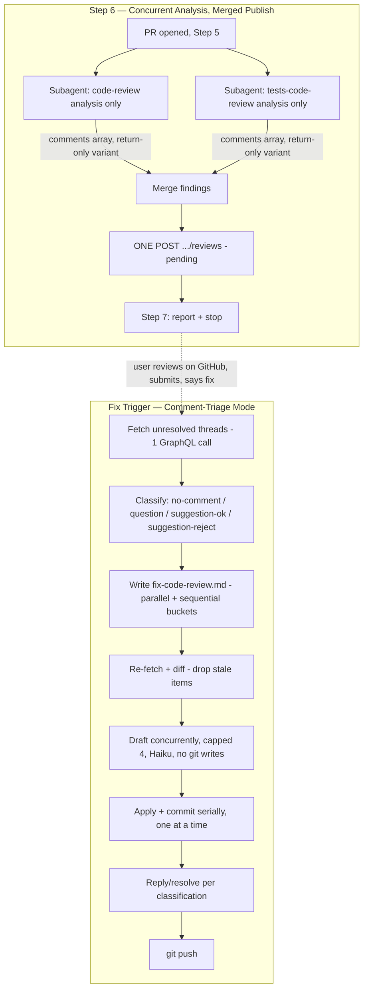

# Ship-Spec Review & Fix-Triage Redesign Design

**Spec**: `.specs/features/ship-spec-review-fix-flow/spec.md`
**Status**: Draft

---

## Approach Exploration — Already Done via Grilling

Normally this section would present 2–3 architectural alternatives before committing. That exploration already happened across a full multi-round grilling session on 2026-08-08 — every major fork (single vs. two Step 6 subagents, worktree isolation vs. split-phase vs. dropped concurrency for fixes, origin-based vs. comment-presence classification, plan-file-with-gate vs. without) was surfaced with trade-offs and decided by the user directly, recorded in `spec.md`'s Assumptions & Open Questions table. This section documents the resulting architecture and the two corrections Design-phase research forced on top of it (see next section) rather than re-deriving alternatives already settled.

## Scope Correction Found During Design

Research (Knowledge Verification Chain Step 4 — GitHub's own REST API docs and community reports, since this is platform behavior no codebase inspection could reveal) surfaced a hard constraint not known during grilling: **GitHub allows only one pending (unsubmitted) review per user per PR at a time** — a second `POST .../reviews` call while one is pending returns HTTP 422, and there is no API to incrementally add comments to an already-open pending review (recorded as `AD-003` in `.specs/STATE.md`). This invalidated the originally-specified "two independently-published pending reviews" mechanism outright — not just for concurrent dispatch, for any dispatch order — and was corrected with the user's direct confirmation (AskUserQuestion) before this document was written; `spec.md`'s first user story and traceability table were updated to match.

That correction has one further consequence: since a pending review's comments must all arrive in one `POST` call, **both `code-review` and `tests-code-review` must hand their findings back to `ship-spec` instead of posting themselves**, so `ship-spec` can merge and issue the single call. This expands the feature's file scope beyond what `spec.md`'s Problem Statement originally named:

| File | Why it's now in scope |
| --- | --- |
| `skills/ship-spec/SKILL.md` | Step 6 rewrite (concurrent analysis, merge, single post) + Comment-Triage Mode rewrite — as originally scoped |
| `templates/github-pr-review-mode.md` | New **Return-Only Variant** of Step B — the minimal mechanism letting a skill assemble its comments array without posting it |
| `skills/code-review/SKILL.md` (Step 9 only) | One-line addition: use the Return-Only Variant when invoked by `ship-spec`'s merged-post flow |
| `skills/tests-code-review/SKILL.md` (Step 9 only) | Same one-line addition |

The last three are small, surgical, additive changes (new opt-in variant; existing interactive posting path for direct/local invocation is untouched) — not a re-scoping of those skills' own review logic.

---

## Architecture Overview

Two independent redesigns share one file (`ship-spec/SKILL.md`) plus one shared template:

1. **Step 6** — `code-review` and `tests-code-review` analyze concurrently (no GitHub writes during analysis); once both return, `ship-spec` merges their findings and posts exactly one pending review.
2. **Comment-Triage Mode** (the "fix findings" flow) — uniform comment-presence classification, a written plan (`fix-code-review.md`), immediate execution (no approval gate) with a fresh re-fetch to drop stale items, and split-phase fix execution: fix-drafting runs concurrently (capped at 4, on Haiku), commits land serialized on the shared checkout.



---

## Code Reuse Analysis

### Existing Components to Leverage

| Component | Location | How to Use |
| --- | --- | --- |
| GitHub PR Mode — Step A (detection) | `templates/github-pr-review-mode.md` | Unchanged — both analysis subagents still use it to fetch PR metadata/diff |
| GitHub PR Mode — Step B2 payload shape (`comments` array: `path`/`line`/`body`) | `templates/github-pr-review-mode.md` | Reused verbatim for both the existing posting path and the new Return-Only Variant — same array shape, different final step (POST vs. return) |
| `reviewThreads` GraphQL query | `skills/ship-spec/references/github-delivery.md` | Reused unchanged for both the plan-build fetch and the re-fetch-before-execute; no new query shape needed |
| `resolveReviewThread` / `addPullRequestReviewThreadReply` mutations | `skills/ship-spec/references/github-delivery.md` | Reused unchanged — still one thread ID per call, invoked more selectively per the new classification rule (silent resolve vs. reply-and-leave-open) |
| Conventional Commits + atomic-commit convention | `tlc-spec-driven` (referenced by existing Comment-Triage Mode step 4) | Reused unchanged for each fix commit |
| `Agent` tool isolated-subagent dispatch pattern | Used throughout `ship-spec/SKILL.md` today | Reused for analysis subagents, drafting subagents, and the serial commit step — same tool, different concurrency/model parameters per component below |

### Integration Points

| System | Integration Method |
| --- | --- |
| GitHub REST (`gh api ... reviews`) | One `POST` per Step 6 run (merged), unchanged endpoint/payload shape from today's Step B2 |
| GitHub GraphQL (`gh api graphql`) | Two calls per fix-trigger run (plan-build fetch, re-fetch-before-execute) instead of today's one — see Tech Decisions for why this is still cheap |
| Local git (shared checkout, no worktree) | Serialized `git add`/`git commit` per fix, same as today's Comment-Triage Mode — concurrency is confined to the drafting phase, which touches no git state |

---

## Components

### Step 6 — Analysis Subagents (concurrent)

- **Purpose**: Run `code-review`'s and `tests-code-review`'s full analysis (diff collection, dimension-agent dispatch) concurrently, returning findings without posting.
- **Location**: `skills/ship-spec/SKILL.md` Step 6 (dispatch instructions); `skills/code-review/SKILL.md` Step 9 and `skills/tests-code-review/SKILL.md` Step 9 (variant reference)
- **Interfaces**:
  - Each subagent invocation: `Agent` tool, `agentType: general-purpose`, `model: sonnet`, `run_in_background: false`, two calls issued in the same turn (not sequential awaits) — prompt instructs "invoke `<skill>` in GitHub PR mode, Return-Only Variant, against PR #N; return the assembled `comments` array and finding counts, do not post."
  - Return shape: `{comments: [{path, line, body}, ...], counts: {total, by_severity}}` per skill, or a failure reason string in place of the above.
- **Dependencies**: PR must already exist (Step 5); `gh auth status` must succeed (Guardrails, unchanged).
- **Reuses**: existing diff-collection and dimension-agent dispatch logic inside `code-review`/`tests-code-review` (untouched) up through what was formerly Step 9's B2 payload assembly.

### GitHub PR Mode — Return-Only Variant

- **Purpose**: Let a skill assemble its GitHub PR review comments array without issuing the `POST`, so a caller (here, `ship-spec`) can merge multiple skills' arrays into one call.
- **Location**: `templates/github-pr-review-mode.md`, new subsection under Step B (e.g. "B2'. Return-Only Variant").
- **Interfaces**: Same inputs as B2 (selected findings, PR diff context); output is the `comments` array as a returned value instead of a `gh api POST` side effect. B1's interactive "user selects findings" prompt is skipped the same way `ship-spec` already skips it for the normal path (documented precedent: Step 6's existing note that `/ship-spec` invocation itself satisfies that gate).
- **Dependencies**: None beyond what B2 already needs.
- **Reuses**: B2's exact comment-shape logic (`path`, `line`, `body`, exact-line anchoring) — this variant only changes the last step (return vs. POST), not the assembly logic.

### Step 6 — Merge & Publish

- **Purpose**: Combine both skills' `comments` arrays into one, issue the single allowed `POST .../reviews` call, and handle the partial-failure case.
- **Location**: `skills/ship-spec/SKILL.md` Step 6 (orchestrator-level, no subagent — this runs in `ship-spec`'s own turn since it's a single cheap API call, not a full skill invocation).
- **Interfaces**: `mergedComments = codeReviewResult.comments ++ testsCodeReviewResult.comments` (or just the succeeded one's, on partial failure); one `gh api repos/{owner}/{repo}/pulls/{PR}/reviews --method POST --input payload.json` call, `event` omitted.
- **Dependencies**: Both analysis subagents' results (or one, on partial failure — never zero, per Guardrails' existing "stop and report" rule on full failure).
- **Reuses**: `templates/github-pr-review-mode.md` B2's exact payload/POST mechanics.

### Comment-Triage Mode — Classification

- **Purpose**: Classify each unresolved, published thread by comment presence/content, uniformly regardless of origin skill.
- **Location**: `skills/ship-spec/SKILL.md`, Comment-Triage Mode step 2 (rewrite).
- **Interfaces**: Input = one thread (body, path, line, any user replies); output = one of `{auto-fix, answer-only, apply-as-directed, pushback}`.
- **Dependencies**: Thread fetch (below).
- **Reuses**: The existing GraphQL `reviewThreads` query and its `isResolved`/`PENDING`-review filters (SSF-03 in spec.md is additive to these, not a replacement).

### Comment-Triage Mode — Plan Generation

- **Purpose**: Write the classified, grouped plan to `fix-code-review.md` before any execution.
- **Location**: `skills/ship-spec/SKILL.md`, new step inserted between classification and execution; file written to `.specs/features/<feature>/fix-code-review.md`.
- **Interfaces**: Simple markdown list, grouped `## Parallel` / `## Sequential`, each item carrying thread ID, classification, and fix direction (see Data Models).
- **Dependencies**: Classification output for every fetched thread.
- **Reuses**: Nothing new — pure orchestrator-turn text generation, no subagent needed for this step.

### Comment-Triage Mode — Split-Phase Fix Execution

- **Purpose**: Draft fixes concurrently (cheap to parallelize, no git writes) while keeping all git writes serialized on the shared, non-worktree checkout.
- **Location**: `skills/ship-spec/SKILL.md`, Comment-Triage Mode steps 3–4 (rewrite).
- **Interfaces**:
  - Drafting subagent: `Agent` tool, `agentType: general-purpose`, `model: claude-haiku-4-5-20251001`, `run_in_background: false` (dispatched up to 4 at once via `parallel()`-style concurrent tool calls in one turn), given the thread's finding + classification + fix direction; returns a proposed diff description, or a blocker reason.
  - Commit application: one at a time, in the orchestrator's own turn or a single non-concurrent subagent per item — applies the drafted change, runs that item's own relevant test(s), commits (Conventional Commits), or marks the item blocked if the drafted change no longer matches current file state.
- **Dependencies**: The re-fetched, de-staled plan (SSF-11).
- **Reuses**: Existing atomic-commit convention; existing `resolveReviewThread`/reply mutations for the follow-up per classification.

---

## Data Models

### `fix-code-review.md` plan entry

```markdown
## Parallel
- T1 [auto-fix] thread:<id> path:<file>:<line> — <one-line fix direction>
- T2 [apply-as-directed] thread:<id> path:<file>:<line> — <one-line fix direction, per user's comment>

## Sequential (same file/thread dependency)
- T3 [auto-fix] thread:<id> path:<file>:<line> — <one-line fix direction>
- T4 [pushback] thread:<id> path:<file>:<line> — <reasoning, no fix>
```

Overwritten fresh each triage run — not accumulated across runs. `pushback`/`answer-only` items appear in the plan for audit-trail completeness but are excluded from the drafting/commit steps (they resolve via reply-only, in the orchestrator's own turn).

**Relationships**: Each entry's `thread:<id>` maps 1:1 to a GraphQL review thread; grouping (Parallel vs. Sequential) is determined by whether two or more items touch the same `path`.

---

## Error Handling Strategy

| Error Scenario | Handling | User Impact |
| --- | --- | --- |
| One Step 6 analysis subagent fails/crashes | Report which skill succeeded/failed with reason; post the merged review containing only the succeeded skill's findings; never retry the one that... wait, retry the *failed* one once per existing Guardrails retry rule, never re-attempt the one that already returned findings if a review was already posted | "9 findings from code-review posted; tests-code-review failed: <reason>. Retrying tests-code-review once." |
| Both Step 6 analysis subagents fail | Stop before any `POST`; report both failures | "Both code-review and tests-code-review failed to complete: <reasons>. No review posted." |
| Fix trigger invoked while review still PENDING | Report immediately, do not fetch/classify/fix | "Review is still pending — submit it on GitHub first." |
| GraphQL fetch fails (rate limit, auth, network) at plan-build or re-fetch time | Report the failure, stop before writing/executing the plan | "Couldn't fetch review threads: <reason>." |
| A thread vanishes/resolves/changes between plan-build fetch and re-fetch | Silently dropped from execution (SSF-11) — no error surfaced, this is expected behavior | Not mentioned unless the user asks; final report's item count simply reflects what actually ran |
| A drafting subagent can't complete (blocked) | Recorded as that item's outcome; other items proceed unaffected | Appears in the final triage summary: "T3 blocked: <reason>" |
| A drafted change no longer matches current file state at commit time (rare, since drafting and committing happen close together) | Item marked blocked at the commit step rather than force-applied | Same as above — surfaces in the final summary, not silently skipped |
| `resolveReviewThread`/reply mutation fails (permissions) | Report per existing `github-delivery.md` convention — never leave silently unresolved without saying so | "Couldn't resolve thread <id>: <reason>." |

---

## Risks & Concerns

| Concern | Location (file:line) | Impact | Mitigation |
| --- | --- | --- | --- |
| Currently-shipped Step 6 claims "two separate pending reviews, one per skill" (`skills/ship-spec/SKILL.md:123`), which does not match GitHub's documented one-pending-review-per-PR limit | `skills/ship-spec/SKILL.md:123` | If ever exercised as literally written, the second skill's `POST` should return HTTP 422 and fail — a possible unnoticed failure in past/current real usage, unrelated to whether this feature ships | This feature's Step 6 rewrite removes the broken mechanism entirely (single merged post, AD-003); recommend the user check whether any past `ship-spec` run actually surfaced this failure, as a follow-up outside this feature's scope |
| `templates/github-pr-review-mode.md` is shared by `code-review`/`tests-code-review` for their own direct/local-mode invocations (interactive B1 selection), not just `ship-spec` | `templates/github-pr-review-mode.md` | A careless edit to B2 could break the existing interactive posting path | New Return-Only Variant is additive (new subsection), B1–B3's existing text is untouched; only Step 9 in each skill gains a one-line conditional reference to the new variant |
| Split-phase drafting still leaves a (small) window between a drafted change and its serialized commit where the target file could have shifted (e.g., an earlier sequential-bucket commit touched a line a later parallel-bucket draft assumed was untouched) | `skills/ship-spec/SKILL.md`, Comment-Triage Mode (new) | A stale draft could be committed against outdated content | Commit step checks the drafted change still applies cleanly against current file state before committing; mismatch → blocked, not force-applied (see Error Handling Strategy) |
| Concurrency cap of 4 for drafting is a fixed default, not derived from repo size or thread count | `skills/ship-spec/SKILL.md`, Comment-Triage Mode (new) | Could be non-optimal for very small (1-2 item) or very large (50+ item) triage rounds | Accepted as a reasonable default per grilling session; not dynamically tuned — revisit only if real usage shows it's meaningfully wrong, per the project's "measure before optimizing further" pattern from `review-dispatch-efficiency` |

> All identified concerns have a stated mitigation — none left open.

---

## Tech Decisions

| Decision | Choice | Rationale |
| --- | --- | --- |
| Step 6 publish mechanism | Concurrent analysis, single merged `POST` | Only mechanism GitHub's API actually supports for two sources of line-anchored findings on one PR without auto-submitting (AD-003) |
| Where the Return-Only Variant lives | Shared `templates/github-pr-review-mode.md`, not duplicated per-skill | Single source of truth for the `comments` array shape; both `code-review` and `tests-code-review` already share Step B, keeping the return-only path shared avoids drift |
| Concurrent fix-commit safety | Split-phase: parallel drafting (no git writes), serial commit application | Resolves the conflict between requested concurrency and the existing "no worktree, shared checkout" rule; confirmed with the user via AskUserQuestion |
| Model tier for fix-drafting | Haiku (`claude-haiku-4-5-20251001`) | Fix direction is already fully decided by classification (default model) before dispatch — mechanical execution, not judgment; see `AD-004` |
| Two extra GraphQL fetches per triage run (plan-build + re-fetch) instead of one | Accepted | Both are single batched queries (not per-item); the correctness gained (dropping stale items without a user-approval gate) is worth two cheap calls per run, not per item |
| Plan file (`fix-code-review.md`) format | Flat markdown list, `## Parallel` / `## Sequential` headers | Matches the user's explicit "no need for a complex plan, just a list" — deliberately simpler than a full `tasks.md`-style document |

> **Project-level decisions**: `AD-003` (one pending review per PR — GitHub platform constraint) and `AD-004` (model-tier scope boundary between judgment and mechanical-execution subagents) have already been appended to `.specs/STATE.md`, since both apply beyond this one feature.
