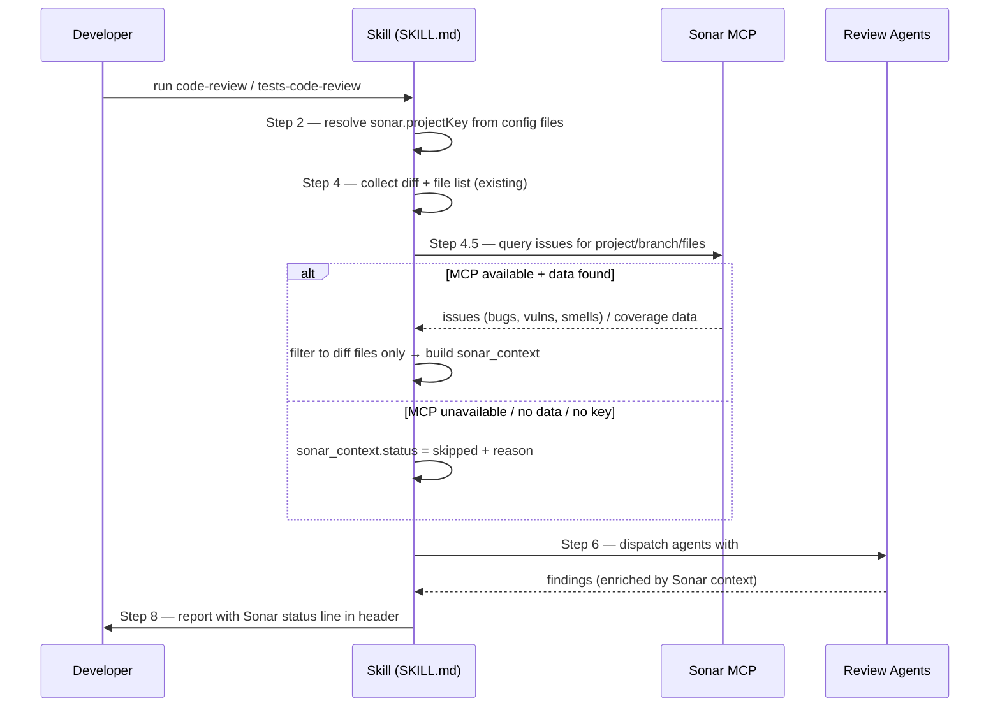

# SonarQube Support — Code Review Design

**Spec**: `.specs/features/sonarqube-support-code-review/spec.md`
**Status**: Draft

---

## Installed Artifacts

Produced by running `sonar integrate claude --global` on 2026-06-30 with `sonar` CLI v1.2.0 against SonarQube Community `http://shared.sonarqube.test/`.

| Artifact | Path / Location | Notes |
|----------|----------------|-------|
| MCP server entry | `~/.claude.json` → `mcpServers.sonarqube` | `command: /Users/flaviostudart/.local/bin/sonar-mcp-wrapper.sh` (see below) |
| Claude Code hook — Read scanner | `~/.claude/settings.json` → `hooks.PreToolUse[Read]` | Runs `pretool-secrets.sh`; scans files Claude reads for secrets |
| Claude Code hook — prompt scanner | `~/.claude/settings.json` → `hooks.UserPromptSubmit[*]` | Runs `prompt-secrets.sh`; scans user prompts for secrets |
| Hook scripts | `~/.claude/hooks/sonar-secrets/build-scripts/pretool-secrets.sh` and `prompt-secrets.sh` | Owned by Sonar install; do not edit |
| Secrets binary | `~/.sonar/sonarqube-cli/bin/sonar-secrets-2.44.0.11370-macos-arm64` | Called by hook scripts |
| Sonar CLI state | `~/.sonar/sonarqube-cli/state.json` | Auth connection, agent registration, installed features |
| Auth token | macOS Keychain — service: `sonarqube-cli`, account: `shared.sonarqube.test` | Read at MCP startup; never in plaintext files |
| MCP Docker wrapper | `~/.local/bin/sonar-mcp-wrapper.sh` | Added to fix Docker DNS routing (see MCP Architecture below) |
| Context augmentation | **Not installed** | Available on SonarQube Cloud only; incompatible with Community edition |

### MCP Architecture

`sonar run mcp` spawns `sonarsource/sonarqube-mcp:latest` as a Docker container. The container cannot resolve `shared.sonarqube.test` (a k3d-hosted domain served via a local DNS at `127.0.0.1` — unreachable from Docker's internal DNS).

Fix: `~/.local/bin/sonar-mcp-wrapper.sh` replaces the `sonar run mcp` entry. It reads the token from the macOS Keychain via `security find-generic-password` and passes `--add-host="shared.sonarqube.test:host-gateway"` to the Docker run command.

The MCP server (`sonarqube-mcp-server` v1.21.0.2975) exposes 18 tools across toolsets: `analysis`, `issues`, `projects`, `quality-gates`, `rules`, `duplications`, `measures`, `security-hotspots`, `dependency-risks`, `coverage`.

### Context Augmentation (Community-incompatible)

`sonar context` reports "not installed". This feature requires SonarQube Cloud — it is not available on SonarQube Server Community edition. SNQ-03 is marked Community-incompatible; the uninstall doc notes this condition.

---

## Architecture Overview

Three files change. One new file is created. No new abstractions introduced.

| File | Change type |
|------|-------------|
| `skills/code-review/SKILL.md` | Modify: add Sonar project key resolution to Step 2, new Step 4.5, injection in Step 6, status line in Step 8 |
| `skills/tests-code-review/SKILL.md` | Modify: same pattern — Step 2, Step 4.5, Step 6, Step 8 — with coverage-specific targets |
| `docs/UNINSTALL_SONAR.md` | New: written after running `sonar integrate claude --global` and observing every installed artifact |

Both skill directories (`~/.claude/skills/code-review`, `~/.claude/skills/tests-code-review`) are symlinked to `skills/` in this repo. Modifying the source file propagates immediately — no reinstall step required.



---

## Approach Selection

Two approaches were considered for where to place the Sonar query in the pipeline:

**Approach A — Centralized fetch at Step 4.5 (after diff, before complexity assessment)**
Query Sonar once, filter results to diff files immediately, build a `sonar_context` object, pass to dispatch. Issue count is known before agents fire, so it can appear in the complexity banner and Step 8 header.

**Approach B — Lazy per-agent fetch in Step 6**
Each agent queries its own Sonar data (security-reviewer queries vulnerabilities, etc.) during dispatch. Avoids loading unused data.

**Chosen: Approach A.** The query is one call against a local server (sub-second latency). Centralizing it keeps the dispatch step clean, lets the complexity banner reference the Sonar status, and avoids multiple round-trips. Lazy fetching would complicate the graceful degradation logic across N agents.

---

## Pipeline Changes

### `skills/code-review/SKILL.md`

#### Step 2 — Context Collection (augmented)

Add project key resolution to the existing context collection step. Check for these files and record presence/absence in the availability map:

| File | Availability key |
|------|-----------------|
| `sonar-project.properties` | `sonar_props` |
| `.sonarlint/connectedMode.json` | `sonar_sonarlint` |

Extract `sonar.projectKey` from `sonar-project.properties` if present; fall back to `projectKey` field in `.sonarlint/connectedMode.json`. Record resolved key (or `absent`) as `sonar_project_key` in the availability map.

#### Step 4.5 — Sonar Context Resolution (new step)

Run this step **after Step 4** (diff file list is known) and **before Step 5** (complexity assessment).

**MCP tool**: `search_sonar_issues_in_projects`
- `projects`: `[sonar_project_key]`
- `branch` (long-lived) or `pullRequest` (PR key — numeric, not branch name)
- `issueStatuses`: `["OPEN"]`
- `files`: diff file paths prefixed with project key — e.g. `project_key:src/foo/bar.py`

**Issue categorization** uses `impactSoftwareQualities` (new SonarQube API, replaces old BUG/VULNERABILITY/CODE_SMELL types):
- `security-reviewer` ← issues where `impactSoftwareQualities` includes `SECURITY`
- `code-quality-reviewer` ← issues where `impactSoftwareQualities` includes `RELIABILITY` or `MAINTAINABILITY`

```
IF sonar_project_key == absent:
    sonar_context = { status: skipped, reason: "no project key found" }
    GOTO Step 5

IF Sonar MCP tools are not available in this session:
    sonar_context = { status: skipped, reason: "MCP not installed" }
    GOTO Step 5

ATTEMPT:
    issues = search_sonar_issues_in_projects(
        projects=[sonar_project_key],
        branch=current_branch,          # long-lived; use pullRequest for PR mode
        issueStatuses=["OPEN"],
        files=[project_key + ":" + f for f in diff_files]
    )
    categorize by impactSoftwareQualities:
        security_issues    = [i for i in issues if "SECURITY" in i.impactSoftwareQualities]
        quality_issues     = [i for i in issues if "RELIABILITY" in i.impactSoftwareQualities
                                                 or "MAINTAINABILITY" in i.impactSoftwareQualities]
    build sonar_context = {
        status: active,
        project_key, branch,
        issues_by_agent: {
            security_reviewer:    security_issues[:30],   # sorted severity desc
            code_quality_reviewer: quality_issues[:30]
        },
        summary: { total: N, security: N, quality: N }
    }
ON server unreachable:
    sonar_context = { status: skipped, reason: "server unreachable" }
ON empty result for branch:
    sonar_context = { status: skipped, reason: "no data for branch <branch> — run sonar-scanner first" }
ON timeout:
    sonar_context = { status: skipped, reason: "query timeout" }
```

#### Step 6 — Dispatch (augmented)

When building each agent's prompt, append a `## Sonar Findings` block if `sonar_context.status == active` and that agent has entries in `sonar_context.issues_by_agent`. Omit the block entirely (do not inject an empty section) if no issues are mapped to that agent.

**`## Sonar Findings` block format:**

```markdown
## Sonar Findings
SonarQube detected the following issues on branch `<branch>` in files within this diff.
Use as additional signal — they do not replace your analysis.

| Type | Severity | Rule | File | Line | Message |
|------|----------|------|------|------|---------|
| VULNERABILITY | HIGH | squid:S2077 | src/auth.py | 42 | SQL injection risk |
```

Cap at 30 issues per agent (sorted severity descending: BLOCKER → CRITICAL → MAJOR → MINOR → INFO) to avoid bloating the prompt.

#### Step 8 — Report Header (augmented)

Add a `Sonar:` line immediately after the `Mode:` line in the report header:

```
# <branch> — Code Review
Scope: ...
Branch: ...
Diff: ...
Run: ...
Mode: local | GitHub PR #N | ...
Sonar: active — 12 issues (3 bugs, 2 vulnerabilities, 7 smells) · branch main
```

Degraded variants:
```
Sonar: skipped — MCP not installed
Sonar: skipped — server unreachable
Sonar: skipped — no project key found
Sonar: no data for branch feature/x — run sonar-scanner first
Sonar: active (partial) — issues only, coverage unavailable
```

---

### `skills/tests-code-review/SKILL.md`

Same four-point injection pattern, with coverage-specific targets:

**Step 2 augmentation:** identical to `code-review` — add `sonar_props`, `sonar_sonarlint`, `sonar_project_key`.

**Step 4.5:** Query Sonar for both issues (test-scoped smells) and coverage data:

**MCP tools used:**
- `search_sonar_issues_in_projects` — maintainability issues on diff files (test smells)
- `get_component_measures` — aggregate coverage metrics (`new_coverage`, `new_lines_to_cover`, `new_uncovered_lines`)
- `search_files_by_coverage` — files in diff with worst coverage (for gap-detector)
- `get_file_coverage_details` — line-by-line uncovered lines per low-coverage file

```
issues = search_sonar_issues_in_projects(
    projects=[sonar_project_key],
    branch=current_branch,
    issueStatuses=["OPEN"],
    impactSoftwareQualities=["MAINTAINABILITY"],
    files=[project_key + ":" + f for f in diff_files]
)

measures = get_component_measures(
    projectKey=sonar_project_key,
    branch=current_branch,
    metricKeys=["new_coverage", "new_lines_to_cover", "new_uncovered_lines"]
)

low_coverage_files = search_files_by_coverage(
    projectKey=sonar_project_key,
    branch=current_branch,
    maxCoverage=80
)
# for each low-coverage file in the diff, optionally call get_file_coverage_details

sonar_context = {
    status: active,
    issues_by_agent: {
        coverage_reviewer: [test-scoped smells from issues[:30]],
        gap_detector: []  # coverage data flows separately
    },
    coverage: {
        new_code_coverage_pct: measures.new_coverage,
        new_lines_to_cover: measures.new_lines_to_cover,
        new_uncovered_lines: measures.new_uncovered_lines,
        low_coverage_files: [f for f in low_coverage_files if f in diff_files]
    }
}
```

**Step 6:** Inject into `gap-detector` (uncovered lines block), `coverage-reviewer` (metrics + smells block). Same 30-issue cap applies to smells.

**Step 8:** Sonar line uses coverage format:
```
Sonar: active — new code coverage 74% · branch main
```

---

## `docs/UNINSTALL_SONAR.md` — Authoring Process

This file **cannot be written before the install is run**. The correct approach:

1. **Task: run `sonar integrate claude --global`** — observe every file created, every config key set, every hook installed. Record the full artifact list.
2. **Task: write `docs/UNINSTALL_SONAR.md`** — one section per artifact type, each with:
   - What was installed (path, config key)
   - Exact removal command
   - Verification command confirming absence

Expected sections based on `sonar integrate claude --global` documentation:
- **MCP server** — entry in `~/.claude/settings.json` under `mcpServers`
- **Git hooks** — pre-commit/pre-push hook files; possibly `git config --global core.hooksPath`
- **Context augmentation** — files in `~/.claude/` or a skills directory; `sonar context` confirms removal
- **Any other artifacts** — discovered at install time

---

## Data Models

### `sonar_context` (in-memory, within skill pipeline)

```
sonar_context = {
  status:       'active' | 'skipped',
  skip_reason:  string | null,
  project_key:  string | null,
  branch:       string,
  summary: {
    bugs:            number,
    vulnerabilities: number,
    code_smells:     number
  },
  issues_by_agent: {
    security_reviewer:    [SonarIssue],
    code_quality_reviewer:[SonarIssue],
    architecture_reviewer:[SonarIssue],   // populated only for P2
    coverage_reviewer:    [SonarIssue],   // tests-code-review only
    gap_detector:         []              // receives coverage, not issues
  },
  coverage: {                             // tests-code-review only
    new_code_coverage_pct: number | null,
    uncovered_lines:       [{ file: string, line: number }]
  }
}
```

### `SonarIssue`

```
{
  type:     'BUG' | 'VULNERABILITY' | 'CODE_SMELL',
  severity: 'BLOCKER' | 'CRITICAL' | 'MAJOR' | 'MINOR' | 'INFO',
  rule:     string,   // e.g. "squid:S2077"
  file:     string,   // relative path matching diff
  line:     number,
  message:  string
}
```

---

## Error Handling Strategy

| Error scenario | Detection | `sonar_context` | Report header |
|---------------|-----------|-----------------|---------------|
| MCP not installed | Tool call unavailable in session | `status: skipped` | `Sonar: skipped — MCP not installed` |
| Server unreachable | Connection error from MCP | `status: skipped` | `Sonar: skipped — server unreachable` |
| No project key | Both config files absent | `status: skipped` | `Sonar: skipped — no project key found` |
| No branch data | MCP returns empty for branch | `status: skipped` | `Sonar: no data for branch <x> — run sonar-scanner first` |
| Query timeout | MCP call exceeds threshold | `status: skipped` | `Sonar: skipped — query timeout` |
| Issues found, no coverage | Partial MCP response | `status: active` | `Sonar: active (partial) — issues only` |
| 0 issues, coverage present | Valid empty result | `status: active` | `Sonar: active — 0 issues · coverage 82%` |

In every skipped state: the skill proceeds identically to pre-integration behavior. No agent receives a `## Sonar Findings` block.

---

## Code Reuse Analysis

### Existing patterns leveraged

| Pattern | Location | How used |
|---------|----------|----------|
| Availability map pattern | `code-review/SKILL.md` Step 2–3 | Extend with `sonar_props`, `sonar_sonarlint`, `sonar_project_key` keys |
| `## Before You Begin` agent block | `code-review/SKILL.md` Step 6 | Append `## Sonar Findings` as additional section using same injection point |
| Report header format | `code-review/SKILL.md` Step 8 | Add `Sonar:` line after existing `Mode:` line |
| EXCLUDE constant | Both skills Step 4 | No change — Sonar filtering is independent of EXCLUDE |
| Graceful degradation pattern | Both skills Step 7 | Same "proceed and mark" approach applied to Sonar step |

### No new helper scripts or utilities

All logic lives inside SKILL.md as natural language instructions to the orchestrator. No code files are added or modified.

---

## Risks & Concerns

| Concern | Location | Impact | Mitigation |
|---------|----------|--------|-----------|
| Sonar MCP tool names unknown | Step 4.5 design uses placeholders | Implementation cannot start until tool names are discovered | First task: run `sonar integrate claude --global`, inspect available tools, update this design with exact tool names before modifying SKILL.md |
| File path format mismatch | Step 4.5 filtering | Sonar paths (project-relative) may not match git diff paths (repo-relative); filtering silently misses all issues | At implement time: test path comparison against a real scan result; normalize both to repo-root-relative before comparing |
| Prompt size with many Sonar issues | Step 6 injection | Large issue lists bloat agent prompts, potentially hitting context limits | 30-issue cap per agent, sorted by severity descending; noted in spec as implementation constraint |
| MCP availability detection | Step 4.5 | No documented way to check tool presence without calling it; wrong detection leads to repeated MCP errors | Attempt the call; treat any "tool not found" error as "MCP not installed"; all other errors map to specific skip reasons |
| `sonar context` behavior unknown | `docs/UNINSTALL_SONAR.md` | Cannot write accurate uninstall steps without running the install | Uninstall doc is written as a task that follows the install task — not before |

---

## Tech Decisions

| Decision | Choice | Rationale |
|----------|--------|-----------|
| Pipeline insertion point | Step 4.5 (after diff, before complexity) | Diff file list is available for immediate filtering; issue count known before dispatch |
| Skill modification approach | Edit `skills/code-review/SKILL.md` and `skills/tests-code-review/SKILL.md` directly | Both are `source: local` symlinked from `skills/`; no override/extended files needed |
| Issue injection cap | 30 per agent | Balances signal value vs. prompt bloat; highest-severity issues prioritized |
| Architecture-reviewer enrichment | P2 — deferred | Requires identifying which Sonar rules are "architecture-tagged"; adds complexity without clear MVP value |
| Sonar MCP tool name discovery | First implementation task, updates design | Binary is compiled; tool names cannot be known until install runs |
