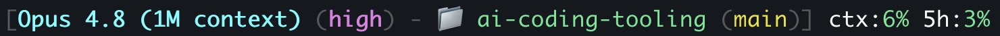

# ai-coding-tooling

Shared agent configuration and skills for Claude Code.

## Installation

Everything is managed by the **`fsvskills`** command (`bin/skills.mjs`) — a single-file Node CLI with no dependencies. It replaces the former `agent-setup`/`skill-manager` skills and the `Makefile`.

> The command is **repo-local for now** — it requires this cloned repository. Making it available on any computer is a planned follow-up (see [docs/TASKS.md](docs/TASKS.md)).

### Prerequisites

- **Node.js ≥ 18** (oldest maintained LTS) and `npx` — bundled with Node. Developed and tested on Node 26.
- Unix-like shell (macOS/Linux)

Check your version with `node --version`. The CLI has zero runtime dependencies, so Node + `npx` is all you need.

### 1. Clone the repository

```bash
git clone <repo-url>
cd ai-coding-tooling
```

### 2. Make the `fsvskills` command available

```bash
npm link
```

This exposes `fsvskills` from any directory on this machine. (Or skip it and run `node bin/skills.mjs …` from the repo.)

> **`fsvskills: command not found` right after `npm link`?**
> Your shell cached the old "not found" result. Run `rehash` (zsh) / `hash -r` (bash) in the current shell, or open a new terminal, then `which fsvskills` should resolve.
>
> **Using nvm?** `npm link` installs the symlink under the **active** Node's global prefix, and `fsvskills` runs on whatever `node` is active in the current directory (its shebang is `#!/usr/bin/env node`). Run `npm link` on the Node version you intend to use, and confirm with `node --version` before a real `setup`. If you add a `.nvmrc` that pins an old version, the CLI will execute on it.

### 3. Set up the agent

```bash
fsvskills setup claude-code
```

One command bootstraps everything:

- **Global:** symlinks `AGENTS.global.md` to the agent's global config, installs every skill by source (project skills via symlink; Tech Leads Club / Matt Pocock via `npx`), applies all `extended/` overrides, and installs any `personal/` skills.
- **Project-local:** creates `.claude → .agents` and `CLAUDE.md → AGENTS.md` so this repo's project-local skills (`.agents/skills/`) and instructions are visible to Claude Code in the project.

It refuses to overwrite an existing global config. To reverse everything `setup` did (remove the global config symlink, uninstall the skills it installed, drop the project-local links), run `fsvskills destroy claude-code`.

### 4. Install the status line script

```bash
fsvskills statusline          # skip if file already exists
fsvskills statusline --force  # overwrite with the version from this repo
```

Installs the Claude Code status line to `~/.claude/statusline-command.sh` (copied from `config/statusline-command.sh`). It shows the active model, effort level, directory, git branch, context-window usage, and the 5-hour rate-limit usage:

```
[Opus 4.8 (1M context) (high) - 📁 ai-coding-tooling (main)] ctx:6% 5h:3%
```



Colors (rendered in the terminal):

| Element | Color |
|---------|-------|
| 🟦 Model (`Opus 4.8`) | bold cyan |
| 🟪 Effort (`high`) | bold magenta |
| 🟩 Directory (`my-project`) | green |
| 🟨 Branch (`main`) | yellow |
| ⬜ Labels (`ctx:`, `5h:`) | white |
| 🟩🟨🟥 Percentages | green < 50%, yellow < 80%, red ≥ 80% |

To customize without losing changes on the next `--force` run, edit `~/.claude/statusline-command.sh` directly and omit `--force`.

## Managing skills

| Command | Action |
|---|---|
| `fsvskills add claude-code <skill> --source <local\|tech-leads-club\|matt-pocock>` | Install one skill and register it in `config/skills.json` |
| `fsvskills delete claude-code <skill>` | Remove one skill: uninstall + deregister from `config/skills.json`; keeps `skills/<skill>` source and `extended/<skill>/` |
| `fsvskills list claude-code` | Show each skill's source and install state |
| `fsvskills override claude-code <skill>` | Scaffold `extended/<skill>/` and apply the overlay onto a vendor skill |
| `fsvskills update claude-code [skills...]` | Update Tech Leads Club / Matt Pocock skills |

`docs/AGENT-SKILLS.md` is regenerated automatically when `add`, `delete`, or `override` change the registry.

Add `--dry-run` to any command to print the actions without changing anything.

## Skills

Skills are reusable agent instructions that extend AI coding tools with specialized workflows. They are grouped below by source.

### Project-Local Skills (`.agents/skills/`)

These skills live in `.agents/skills/`. `fsvskills setup` creates a `.claude → .agents` symlink so Claude Code loads them at project scope in this repo (Claude Code reads `.claude/skills/`, not `.agents/skills/` directly). No global installation required.

| Skill | Description |
|---|---|
| **kb-from-folder** | Reads files or folders (local paths or GitHub repositories via SSH), extracts intelligence, and produces a comprehensive Markdown knowledge note saved to the Obsidian vault. |
| **kb-from-raindrop** | Converts a Raindrop.io bookmark collection into a consolidated knowledge base in the Obsidian vault. Clusters bookmarks by topic and generates deduplicated `.md` files per cluster. |
| **skill-architect** | Expert guide for designing and building high-quality skills through structured conversation. Source: Tech Leads Club. Installed locally. |

> Skill installation/update is handled by the `fsvskills` command (`bin/skills.mjs`), not by a skill. See [Managing skills](#managing-skills).

### Source: This Project (`ai-coding-tooling`)

Maintained here and installed globally via `fsvskills setup` / `fsvskills add`. These are the only skills you should modify:

| Skill | Description |
|---|---|
| **architecture-evaluate** ⭐ | Creates, updates, and incrementally syncs project context documentation across three modes. **Full** deep-scans the codebase to create/update the three mandatory context files (`PROJECT_DETAILS.md`, `ARCHITECTURE.md`, `PIPELINE.md`) inside `docs/codebase/`. **Incremental** inspects the git workspace and syncs only what changed — inline API docs, root context files, the `docs/codebase/` context files — and detects new packages. **Package** generates a scoped `CLAUDE.md` for an individual package/module. Run Full mode when onboarding a new project or when context files are missing; Incremental mode to keep docs in sync with code changes. |
| **code** | Apply coding guidelines when writing code. Thin delegator to `coding-guidelines` (TLC). Pairs with `code-review` for the `/code` + `/code-review` naming pattern. |
| **code-review** | Performs comprehensive code reviews covering architecture, performance, code quality, API design, and security. Reviews local workspace changes by default, or a GitHub PR when a PR number is provided. Also performs standalone Performance Audits (full-codebase P0–P3 findings report) when triggered by performance audit phrases. |
| **tech-debt-report** | Documents tech debts in `docs/tech-debts/` and maintains an anti-pattern index in `docs/TECH_DEBTS.md` so agents avoid replicating bad patterns. |
| **tech-reference-add** ⭐ | Adds technology-specific reference files across all skills and extends qualifying global skills. Run this when adding a new framework or language to a project's stack. |
| **tests** | Writes and maintains tests — unit, integration, and coverage analysis. |
| **tests-code-review** | Reviews test code quality, coverage patterns, and maintainability. Supports local workspace and GitHub PR review modes. |

> ⭐ **Highlighted skills:**
>
> - **`architecture-evaluate`** — The recommended first step for any new or onboarded project. It generates the context files in `docs/` that agents load progressively based on task relevance.
> - **`tech-reference-add`** — The recommended way to extend the tooling for a new technology. It propagates tech-specific reference files into all relevant skills (code review, coding guidelines, tests, etc.) in one step.
> - **`tech-debt-report`** — Documents known anti-patterns so agents avoid replicating them. The `docs/TECH_DEBTS.md` index is loaded automatically when writing or reviewing code.

### Skill Aliases

Aliases are thin delegators that provide shorter slash commands for existing skills. The original skill remains unchanged and fully functional.

| Alias | Original Skill | Description |
|---|---|---|
| **code** | `coding-guidelines` | Short command for `/coding-guidelines`. Pairs with `/code-review`. |

### Personal Skills (`personal/`)

You can add private, local-only skills that are never committed to git. Create a `personal/` directory at the project root and add skill subdirectories inside it — each must contain a `SKILL.md` file following the same structure as `skills/`.

```
personal/
  my-private-skill/
    SKILL.md
```

`fsvskills setup` auto-discovers and installs everything in `personal/` via symlink. These skills are never listed in `config/skills.json` and are discovered dynamically at setup time.

The `personal/` directory is gitignored — nothing inside it is tracked or committed.

## Recommended MCP Servers

| MCP Server | Purpose | Used by |
|---|---|---|
| **[Context7](https://context7.com)** | Fetches up-to-date documentation and code examples for any library. Provides authoritative raw material when generating technology-specific reference files. | `tech-reference-add` (Step 7) |

Context7 is optional but strongly recommended. When available, `tech-reference-add` queries it for official documentation to ground reference files in current best practices rather than relying solely on LLM training data. If unavailable, the skill falls back to the agent's own knowledge.

### Source: [Tech Leads Club](https://techlead.club)

Installed globally by `fsvskills setup`. Treated as read-only — do not edit these directly:

| Skill | Description |
|---|---|
| **codenavi** | Pathfinder for navigating unknown codebases. Investigates with precision, implements surgically, and never assumes. Use when fixing bugs, implementing features, refactoring, or investigating flows in unfamiliar territory. |
| **coding-guidelines** | Behavioral guidelines to reduce common LLM coding mistakes. Applied when writing or reviewing code. |
| **docs-writer** | Writing, reviewing, and editing documentation and `.md` files. |
| **security-best-practices** | Language and framework specific security reviews (Python, JavaScript/TypeScript, Go). |
| **subagent-creator** | Guide for creating AI subagents with isolated context for complex multi-step workflows. |
| **technical-design-doc-creator** | Creates comprehensive Technical Design Documents (TDD) following industry standards. |
| **web-design-guidelines** | Reviews UI code for accessibility, design, and best-practices compliance. |

### Source: [Matt Pocock](https://github.com/mattpocock/skills)

Installed on demand via the `npx skills` CLI. Treated as read-only — override via `extended/<skill>/` rather than editing directly.

No Matt Pocock skills are adopted yet — the vendor is wired up and ready. Install one with:

```bash
fsvskills add claude-code <skill> --source matt-pocock
```
