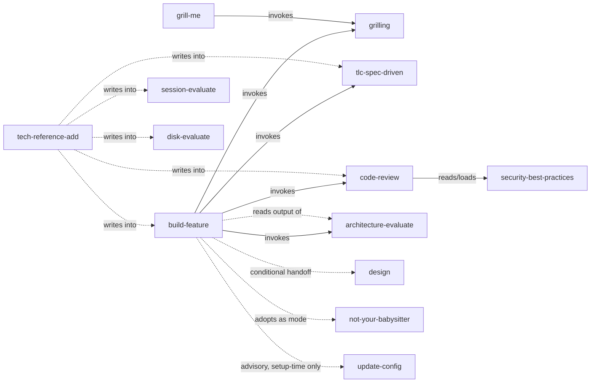

# Skills Dependency Map

Which skill relies on which other skill, and how. Derived by reading each local skill's `SKILL.md` (and its `references/`) in `skills/` and `extended/`, plus `config/skills.json` for source/scope — not from memory. Vendor skills that live only in the global `~/.claude/skills/` install (no local overlay) are included as nodes when a local skill depends on them, but their own internal logic isn't grep-verifiable from this repo.

Keep this file in sync: whenever a skill starts or stops invoking, reading the output of, or otherwise relying on another skill, update the edge here in the same change.

## Legend

| Relationship | Meaning |
|---|---|
| **adopts as mode** | Layers the other skill's stance/behavior over its own run; not a discrete invoked step |
| **invokes** | Calls the other skill via the `Skill` tool, or via an `Agent`-dispatched subagent told to run it, during its own run |
| **reads output of** | Consumes files/artifacts the other skill produces, without invoking it |
| **writes into** | Appends content into the other skill's own files (e.g. reference files), without invoking it |

## Diagram

## Per-Skill Dependencies

Alphabetical by skill name. "Depends on" and "Depended on by" list only edges verified above; a blank cell means none found.

| Skill | Source | Depends On | Depended On By |
|---|---|---|---|
| **architecture-evaluate** | local | — | `build-feature` (invokes + reads output) |
| **build-feature** | local | `architecture-evaluate` (invokes, reads output), `code-review` (invokes), `design`* (conditional handoff), `grilling` (invokes), `not-your-babysitter` (adopts as mode), `tlc-spec-driven` (invokes), `update-config`* (advisory) | `tech-reference-add` (writes into) |
| **code-review** | local | `security-best-practices` (reads/loads, via its `security-reviewer` dimension agent) | `build-feature` (invokes), `tech-reference-add` (writes into) |
| **codenavi** | tech-leads-club | — | — |
| **disk-evaluate** | local | — | `tech-reference-add` (writes into, has a `references/` dir but not currently a documented tech-insight target) |
| **docs-writer** | tech-leads-club | — | — |
| **grill-me** | matt-pocock | `grilling` (invokes)** | — |
| **grilling** | matt-pocock | — | `build-feature` (invokes), `grill-me` (invokes)** |
| **harness-eval** | tech-leads-club | — | — |
| **jira-assistant** | tech-leads-club | — | — |
| **mermaid-studio** | tech-leads-club (extended) | — | — |
| **not-your-babysitter** | local | — | `build-feature` (adopts as mode) |
| **qa-steps** | local | — | — |
| **security-best-practices** | tech-leads-club | — | `code-review` (reads/loads) |
| **session-evaluate** | local | — | `tech-reference-add` (writes into) |
| **skill-architect** | tech-leads-club (extended) | — | — |
| **subagent-creator** | tech-leads-club | — | — |
| **subagent-dispatch** | local | — | consulted implicitly by any skill dispatching via the `Agent` tool (observed: `build-feature`, `code-review`, `architecture-evaluate`, `session-evaluate`) — see note below |
| **tech-reference-add** | local | any skill under `skills/`/`extended/` with a `references/` folder, discovered dynamically each run | — |
| **technical-design-doc-creator** | tech-leads-club | — | — |
| **tlc-spec-driven** | tech-leads-club (extended) | — | `build-feature` (invokes), `tech-reference-add` (writes into) |

\* `design` (Claude Design's `DesignSync`) and `update-config` are Claude Code built-in skills, not entries in `config/skills.json`.

\** `grill-me` → `grilling` is documented in `README.md`'s skills table ("delegates to `grilling`"); both are installed globally by the `matt-pocock` source and have no local overlay in this repo, so it isn't grep-verifiable here.

## Notes

- **`tlc-spec-driven` does *not* depend on `security-best-practices`.** An earlier version of the `extended/tlc-spec-driven/` overlay routed security-sensitive tasks to it (`## Security` in `coding-principles.md`); this was deliberately removed (`extended/tlc-spec-driven/STATE.md` AD-013) — the user decided the overlay should name no other skill, since a skill loads on its own from its description when its work comes up. **`README.md`'s Tech Leads Club table still describes `tlc-spec-driven` as routing security there — that line is now stale** and should be corrected the next time the README's skills tables are touched.
- **Shared MCP usage is not a skill dependency.** `qa-steps` and `jira-assistant` both use the Jira/Atlassian MCP; `code-review`'s optional Jira-sync capability (`references/jira-sync.md`) calls the Atlassian MCP directly too. None of these invoke `jira-assistant` itself.
- **`session-evaluate` has no fixed dependency edge.** It analyzes whatever skill(s) the user names, or the whole session by default, generically — not a specific set of skills.
- **`subagent-dispatch` is a cross-cutting convention reference**, not invoked via the `Skill` tool by name. Any skill that dispatches subagents through the `Agent` tool points to it instead of restating the dispatch contract.
- **Standalone skills** (no in-repo dependency edges either direction): `codenavi`, `disk-evaluate`, `docs-writer`, `harness-eval`, `jira-assistant`*, `mermaid-studio`, `qa-steps`*, `skill-architect`, `subagent-creator`, `technical-design-doc-creator`. (*`jira-assistant` and `qa-steps` share an MCP but neither invokes the other — see above. `qa-steps` previously read `architecture-evaluate`'s output — `skills/qa-steps/STATE.md` AD-004 — and now sources its optional technical spot-check from whatever context is already available instead.)
