# build-feature — Workflow Diagram

Not loaded by `SKILL.md` at runtime — this is a human-facing reference for understanding or modifying the skill, not agent-facing instruction. See `SKILL.md` for the actual steps and `references/progress-schema.md` for resume mechanics.

```mermaid
flowchart TD
    Start([Invocation]) --> Step0{progress.md<br/>exists?}

    Step0 -- no --> S1[Step 1: Worktree + branch<br/>EnterWorktree, native]
    Step0 -- "yes, complete,<br/>PR merged/closed" --> Cleanup[Sweep + remove worktrees<br/>across ALL completed specs]
    Step0 -- "yes, complete,<br/>PR open" --> ReEntry[fix-review only,<br/>existing worktree]
    Step0 -- "yes, in-progress" --> Resume[Resume at first<br/>incomplete step]

    Cleanup --> End1([Stop])
    ReEntry --> Step14b[architecture-evaluate<br/>if commits pushed]
    Step14b --> End2([Stop])

    S1 --> S2[Step 2: Push branch]
    S2 --> S3[Step 3: Draft PR — stub body]
    S3 --> S4[Step 4: Quick arch-eval gate<br/>Sonnet subagent, dispatched — not awaited]
    S4 -.background.-> S7aWait
    S3 --> S5[Step 5: Grilling<br/>live in this conversation, not a subagent]
    S5 --> S6[Step 6: Create feature folder<br/>+ grilling-session.md]

    S6 --> S7aWait[Collect Step 4's result<br/>Agent Wait Protocol]
    S7aWait --> S7a[Step 7a: Specify — Opus]
    S7a --> CP1{human_review<br/>and spec not excluded?}
    CP1 -- yes --> Wait1[Pause: approve spec.md]
    CP1 -- no --> S7b
    Wait1 --> S7b[Step 7b: Design — Opus<br/>reads spec.md fresh]

    S7b --> CP2{Design ran AND<br/>human_review AND<br/>design not excluded?}
    CP2 -- yes --> Wait2[Pause: approve design.md]
    CP2 -- no --> S8
    Wait2 --> S8[Step 8: Tasks — Sonnet<br/>reads spec.md + design.md fresh]

    S8 --> S9[Step 9: Commit + push spec artifacts]
    S9 --> S10[Step 10: Execute — Sonnet<br/>tlc-spec-driven owns gate checks + Verifier]
    S10 --> S11[Step 11: Push Execute's commits +<br/>rewrite PR description]

    S11 --> CR[complete-review<br/>always publishes pending review immediately]
    CR --> S12{human_review and<br/>complete-review<br/>not excluded?}
    S12 -- yes --> Wait3[Pause: user reviews the<br/>pending review on GitHub]
    Wait3 --> S13
    S12 -- no --> S13[Step 13: fix-review<br/>same worktree, no new one]

    S13 --> S14[Step 14: architecture-evaluate<br/>Full — Sonnet]
    S14 --> S15{".design-sync/config.json<br/>exists?"}
    S15 -- yes --> S15a[Step 15: design-sync — Sonnet]
    S15 -- no --> S16
    S15a --> S16[Step 16: gh pr ready<br/>progress.md → complete]
    S16 --> End3([Worktree stays —<br/>signal-driven cleanup only])
```

## Key architectural notes (not in SKILL.md, kept here for maintainers)

- **Steps 7a/7b are two separate Opus subagent calls, not one.** A single subagent call returns once, at the end — it can't pause mid-conversation for a `human_review` checkpoint. Making `spec` and `design` independently gate-able requires two calls, the second reading `spec.md` fresh off disk rather than sharing conversation state with the first.
- **Grilling (Step 5) is not a subagent dispatch, deliberately.** An `Agent`-tool subagent runs once, in the background, to completion — it cannot pause mid-run for a real reply from the user, and grilling's whole mechanic is multi-round back-and-forth with the user. So Step 5 runs `grilling` directly, in this conversation, via the `Skill` tool. Step 4 (the quick arch-eval gate) is still a background subagent — dispatched at the start of Step 4, then collected only once Step 5's conversation concludes, right before Step 7a. Fire-and-collect-later, not concurrent-and-awaited-together as it was before this design's fix — the two steps don't need to finish at the same moment, only before Step 7a needs Step 4's result.
- **The orchestrator never writes large file content into its own context.** Every subagent gets metadata and paths; it does its own reads. This is what keeps a 15+ step run from blowing the orchestrator's context window.
- **`complete-review` always publishes immediately; `human_review` only gates the pause before `fix-review`.** Earlier versions had this skill pass `human_review: true` to `complete-review` so findings stayed off GitHub until approved in this conversation, then posted via a separate Publish Mode call. That round trip is gone — Step 12 now always lets `complete-review` post its pending review right away (its own unchanged default), and `human_review` decides only whether this skill pauses afterward, before Step 13 runs. The pending review is still unsubmitted (only the authenticated reviewer sees it), so this doesn't expose unapproved findings to anyone else.
- **Step 11 also pushes now.** Step 10 (Execute) only commits locally — nothing pushed those commits to origin before `complete-review` (Step 12) reviewed the PR, so `complete-review` could review a stale remote branch. Step 11 now pushes first, before rewriting the PR description.
- **Worktree cleanup is signal-driven, not automatic-on-completion.** A PR merged via the GitHub UI, with build-feature never re-invoked, would otherwise leave the worktree on disk forever — the sweep at Step 0 checks every tracked spec's worktree, not just the current one.
