# build-feature — Workflow Diagram

Not loaded by `SKILL.md` at runtime — this is a human-facing reference for understanding or modifying the skill, not agent-facing instruction. See `SKILL.md` for the actual steps and `references/progress-schema.md` for resume mechanics.

```mermaid
flowchart TD
    Start([Invocation, task_id]) --> Sweep[Step 0: git worktree list →<br/>sweep: remove worktrees of<br/>merged/closed PRs across ALL specs]
    Sweep --> Step0{.specs/features/task_id-*/<br/>progress.md in a worktree?}

    Step0 -- no --> S1[Step 1: Worktree + branch<br/>EnterWorktree, native<br/>progress.md --init]
    Step0 -- "yes, PR<br/>merged/closed" --> End1([Report, stop])
    Step0 -- "yes, complete,<br/>PR open" --> ReEntry[code-review fix-existing-findings entry,<br/>existing worktree]
    Step0 -- "yes, in-progress" --> Resume[Resume at first<br/>incomplete step]

    ReEntry --> Step11b[architecture-evaluate<br/>if commits pushed]
    Step11b --> End2([Stop])

    S1 --> SY[Step 1b: Sync docs/codebase into worktree<br/>only if untracked/ignored in the repo]
    SY --> S2[Step 2: Push branch — empty,<br/>no PR yet]
    S2 --> S3[Step 3: Grilling<br/>live in this conversation, not a subagent]
    S3 --> S4[Step 4: Write grilling-session.md<br/>into the feature folder]

    S4 --> S5a[Step 5a: Specify — Sonnet]
    S5a --> CP1{human_review<br/>and spec not excluded?}
    CP1 -- yes --> Wait1[spec: pending → pause:<br/>approve spec.md → approved]
    CP1 -- no --> S5b
    Wait1 --> S5b[Step 5b: Design — Sonnet<br/>reads spec.md fresh]

    S5b --> CP2{Design ran AND<br/>human_review AND<br/>design not excluded?}
    CP2 -- yes --> Wait2[design: pending → pause:<br/>approve design.md → approved]
    CP2 -- no --> S6
    Wait2 --> S6[Step 6: Tasks — Haiku<br/>reads spec.md + design.md fresh<br/>may be skipped by auto-sizing]

    S6 --> S7[Step 7: Commit + push spec artifacts,<br/>open draft PR now — first real commit]
    S7 --> S8[Step 8: Execute — Sonnet<br/>tlc-spec-driven owns gate checks + Verifier]
    S8 --> S9[Step 9: Push Execute's commits +<br/>rewrite PR description]

    S9 --> CR[Step 10: code-review via Skill, in this conversation<br/>review worker posts a pending review]
    CR --> CP3{code-review checkpoint:<br/>human_review and<br/>code-review not excluded?}
    CP3 -- yes --> Wait3[Record code_review: pending, end turn<br/>user edits on GitHub, replies<br/>resume: continue-after-checkpoint entry]
    Wait3 --> SubmitCR
    CP3 -- no --> SubmitCR[code-review submits<br/>COMMENT]
    SubmitCR --> Fix[code-review fix worker — Sonnet<br/>same worktree, fixes, pushes, replies, resolves]

    Fix --> S11[Step 11: architecture-evaluate — Sonnet<br/>origin/base_branch...HEAD, picks its own mode]
    S11 --> SYB[Sync docs/codebase back to main tree<br/>only if Step 1b copied it in]
    SYB --> DSCheck{".design-sync/config.json<br/>exists?"}
    DSCheck -- yes --> S12a[Step 12: design-sync handoff<br/>nothing run — user runs it after]
    DSCheck -- no --> S13
    S12a --> S13[Step 13: merge check, gh pr ready<br/>progress.md → complete]
    S13 --> End3([Worktree stays until<br/>PR merged/closed])
```

## Key architectural notes (not in SKILL.md, kept here for maintainers)

- **The models in this diagram are a restatement.** `SKILL.md`'s step headings name each dispatch's model; this diagram mirrors them and is the one that silently drifts, since nothing at runtime reads it.
- **The draft PR opens at Step 7, not right after the branch is pushed.** An earlier version opened it immediately after Step 2's push, as a stub with an empty body — but `gh pr create` unconditionally rejects a branch with zero commits ahead of `base_branch` (`No commits between <base> and <head>`), so that call failed on every single run. Opening it right after the spec artifacts are committed and pushed — the branch's first real commit — fixes this at the root instead of papering over it with an empty placeholder commit just to satisfy GitHub earlier.
- **Steps 5a/5b are two separate subagent calls, not one.** A single subagent call returns once, at the end — it can't pause mid-conversation for a `human_review` checkpoint. Making `spec` and `design` independently gate-able requires two calls, the second reading `spec.md` fresh off disk rather than sharing conversation state with the first.
- **Grilling (Step 3) is not a subagent dispatch, deliberately.** An `Agent`-tool subagent runs once, in the background, to completion — it cannot pause mid-run for a real reply from the user, and grilling's whole mechanic is multi-round back-and-forth with the user. So Step 3 runs `grilling` directly, in this conversation, via the `Skill` tool.
- **There is no architecture-evaluate gate step.** An earlier Step 3 dispatched a Haiku subagent to decide `none`/`incremental`/`full` from `architecture-evaluate`'s trigger table, but no answer changed any later step. `architecture-evaluate` picks its own mode at Step 11; see STATE.md AD-023.
- **The orchestrator never writes large file content into its own context.** Every subagent gets metadata and paths; it does its own reads. This is what keeps a 13+ step run from blowing the orchestrator's context window.
- **`progress.md` is written by a script, not hand-edited.** `scripts/progress.mjs` creates it (with its folder) at Step 1, then bumps `last_completed_step`, writes the `Step Log` line, and applies any `Run State` field updates in one call. A measured run hand-edited it 24 times (2-3 `Edit` calls per step, each re-anchoring on the full previous `Step Log` line just to append one more) — ~12 avoidable round-trips the script collapses into one call per step, and it's idempotent on a re-run of the same step, which raw `Edit` calls were not.
- **`progress.md` lives only in the worktree.** It is never committed, so a later session starting in the main checkout finds a run by enumerating `git worktree list` and globbing `.specs/features/<task_id>-*/progress.md` — the slug never has to be re-derived, and a re-invocation needs only `task_id`.
- **The worktree's deferred tools (`EnterWorktree`/`ExitWorktree`/`Monitor`) load together, once, at Step 1.** A measured run loaded each with its own `ToolSearch` call at the moment it was first needed instead — a few extra full-conversation round-trips for something knowable up front.
- **Step 10 calls `code-review` via `Skill` from the orchestrator; every other delegated step dispatches a subagent.** Steps 11 and 12 of an older numbering used to both dispatch wrapper subagents, because a separate fix skill kept classification, fixing, and thread replies in whatever context invoked it — invoked from the orchestrator, that cost 39–60% of the entire main session on four production runs (16.6M / 30.3M / 40.8M / 42.7M cache-read). `code-review` now owns review and fix as one run and, from a root conversation, does its heavy work only in its own review and fix workers, so invoking it here costs the orchestrator only compact results. It has to run here: its `human_review` checkpoint ends the turn, and a subagent cannot pause for the user. See STATE.md AD-014.
- **`docs/codebase/` is synced into the worktree and back out.** A fresh `EnterWorktree` checkout carries neither untracked nor ignored files, so when a repo keeps its context docs untracked the worktree looks like a project with none. That misfired at both ends: the old gate step escalated to a Full brownfield scan (41 minutes in one measured run), and the docs sync's output then died with the worktree because the path was gitignored — 7 of 9 files lost in one run, ~13.6M tokens of documentation that never reached a PR in another. Copy-in happens at Step 1 from the repo's *main* working tree (never a sibling worktree, which may hold a different run's stale copy); copy-out happens right after Step 11, not at Step 13, so an early stop still lands the docs, and it refuses to overwrite a source that changed mid-run. When the repo tracks `docs/codebase/`, none of this runs — which is the better arrangement, and worth saying so to the user.
- **`human_review` is passed through to `code-review`, which owns the pause.** `code-review` always posts its review as pending first; with `human_review: true` (and `code-review` not in `human_review_exclude`) its checkpoint shows the summary and ends this turn so the user can edit, delete, or submit comments on GitHub before anything is fixed; otherwise it continues. Whatever the user removed is no longer a finding — the fix worker fetches threads fresh.
- **`code-review` owns its own recovery.** `build-feature` never retries a `code-review` failure: if `code-review` still reports one after its own recovery, Step 10 stops and reports it. The continue-after-checkpoint entry is never used for a review or posting failure — it never posts, so using it there would mark a PR ready with its findings lost.
- **Step 9 also pushes.** Step 8 (Execute) only commits locally — nothing pushed those commits to origin before `code-review` (Step 10) reviewed the PR, so it could review a stale remote branch. Step 9 pushes first, before rewriting the PR description.
- **Worktree cleanup is signal-driven, not automatic-on-completion.** A PR merged via the GitHub UI, with build-feature never re-invoked, would otherwise leave the worktree on disk forever — the sweep at Step 0 checks every tracked spec's worktree, not just the current one, and removes it with `git worktree remove` from the main checkout (`ExitWorktree` only acts on worktrees entered in the same session).
