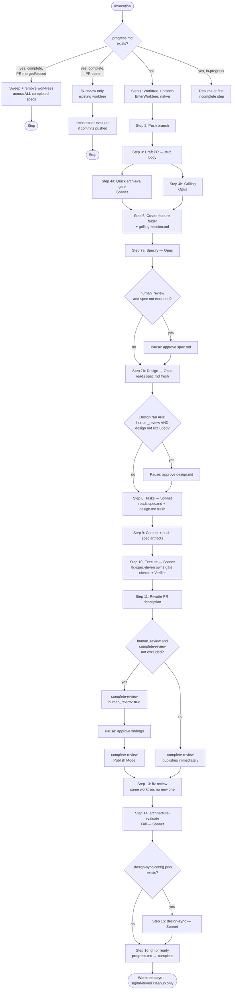

# build-feature — Workflow Diagram

Not loaded by `SKILL.md` at runtime — this is a human-facing reference for understanding or modifying the skill, not agent-facing instruction. See `SKILL.md` for the actual steps and `references/progress-schema.md` for resume mechanics.

## Key architectural notes (not in SKILL.md, kept here for maintainers)

- **Steps 7a/7b are two separate Opus subagent calls, not one.** A single subagent call returns once, at the end — it can't pause mid-conversation for a `human_review` checkpoint. Making `spec` and `design` independently gate-able requires two calls, the second reading `spec.md` fresh off disk rather than sharing conversation state with the first.
- **Steps 4a/4b run concurrently** (two `Agent` calls in one turn) — safe because only 4a ever touches git; 4b (grilling) never pushes.
- **The orchestrator never writes large file content into its own context.** Every subagent gets metadata and paths; it does its own reads. This is what keeps a 15+ step run from blowing the orchestrator's context window.
- **Worktree cleanup is signal-driven, not automatic-on-completion.** A PR merged via the GitHub UI, with build-feature never re-invoked, would otherwise leave the worktree on disk forever — the sweep at Step 0 checks every tracked spec's worktree, not just the current one.
