# build-feature — Workflow Diagram

Not loaded by `SKILL.md` at runtime — this is a human-facing reference for understanding or modifying the skill, not agent-facing instruction. See `SKILL.md` for the actual steps and `references/progress-schema.md` for resume mechanics.

```mermaid
flowchart TD
    Start([Invocation]) --> Step0{progress.md<br/>exists?}

    Step0 -- no --> S1[Step 1: Worktree + branch<br/>EnterWorktree, native]
    Step0 -- "yes, complete,<br/>PR merged/closed" --> Cleanup[Sweep + remove worktrees<br/>across ALL completed specs]
    Step0 -- "yes, complete,<br/>PR open" --> ReEntry[fix-review only,<br/>existing worktree]
    Step0 -- "yes, in-progress" --> Resume[Resume at first<br/>incomplete step]

    Cleanup --> End1([Stop])
    ReEntry --> Step13b[architecture-evaluate<br/>if commits pushed]
    Step13b --> End2([Stop])

    S1 --> SY[Step 1b: Sync docs/codebase into worktree<br/>only if untracked/ignored in the repo]
    SY --> S2[Step 2: Push branch — empty,<br/>no PR yet]
    S2 --> S3[Step 3: Arch-eval gate — decision only<br/>Haiku subagent, dispatched — not awaited]
    S3 -.background.-> S6aWait
    S2 --> S4[Step 4: Grilling<br/>live in this conversation, not a subagent]
    S4 --> S5[Step 5: Create feature folder<br/>+ grilling-session.md]

    S5 --> S6aWait[Collect Step 3's result<br/>Agent Wait Protocol]
    S6aWait --> S6a[Step 6a: Specify — Sonnet]
    S6a --> CP1{human_review<br/>and spec not excluded?}
    CP1 -- yes --> Wait1[Pause: approve spec.md]
    CP1 -- no --> S6b
    Wait1 --> S6b[Step 6b: Design — Sonnet<br/>reads spec.md fresh]

    S6b --> CP2{Design ran AND<br/>human_review AND<br/>design not excluded?}
    CP2 -- yes --> Wait2[Pause: approve design.md]
    CP2 -- no --> S7
    Wait2 --> S7[Step 7: Tasks — Haiku<br/>reads spec.md + design.md fresh]

    S7 --> S8[Step 8: Commit + push spec artifacts,<br/>open draft PR now — first real commit]
    S8 --> S9[Step 9: Execute — Sonnet<br/>tlc-spec-driven owns gate checks + Verifier]
    S9 --> S10[Step 10: Push Execute's commits +<br/>rewrite PR description]

    S10 --> CR[Step 11: complete-review — Sonnet subagent<br/>always publishes pending review immediately]
    CR --> CP3{human_review and<br/>complete-review<br/>not excluded?}
    CP3 -- yes --> Wait3[Pause: user reviews +<br/>submits the pending review on GitHub]
    Wait3 --> S12
    CP3 -- no --> SubmitCR[Submit the pending review<br/>gh graphql, COMMENT event]
    SubmitCR --> S12[Step 12: fix-review — Haiku subagent<br/>same worktree, no new one]

    S12 --> S13[Step 13: architecture-evaluate<br/>Incremental always — Sonnet]
    S13 --> SYB[Sync docs/codebase back to main tree<br/>only if Step 1b copied it in]
    SYB --> DSCheck{".design-sync/config.json<br/>exists?"}
    DSCheck -- yes --> S14a[Step 14: design-sync — Sonnet]
    DSCheck -- no --> S15
    S14a --> S15[Step 15: gh pr ready<br/>progress.md → complete]
    S15 --> End3([Worktree stays —<br/>signal-driven cleanup only])
```

## Key architectural notes (not in SKILL.md, kept here for maintainers)

- **The models in this diagram are a restatement, not the source of truth.** Every dispatch site's model lives in [Subagent Models](../../templates/subagent-models.md); `SKILL.md`'s step headings and this diagram both mirror that table. Retune there first, then update both mirrors — this diagram in particular is the one that silently drifts, since nothing at runtime reads it.

- **The draft PR opens at Step 8, not right after the branch is pushed.** An earlier version opened it immediately after Step 2's push, as a stub with an empty body — but `gh pr create` unconditionally rejects a branch with zero commits ahead of `base_branch` (`No commits between <base> and <head>`), so that call failed on every single run. Moving it to Step 8 — right after the spec/design/tasks artifacts are committed and pushed, the branch's first real commit — fixes this at the root instead of papering over it with an empty placeholder commit just to satisfy GitHub earlier. The cost is that everything from the old Step 4 onward renumbered by one (see `progress-schema.md`'s `Step Log`, which now logs the PR's own line under Step 8 instead of a standalone Step 3).
- **Steps 6a/6b are two separate subagent calls, not one.** A single subagent call returns once, at the end — it can't pause mid-conversation for a `human_review` checkpoint. Making `spec` and `design` independently gate-able requires two calls, the second reading `spec.md` fresh off disk rather than sharing conversation state with the first.
- **Grilling (Step 4) is not a subagent dispatch, deliberately.** An `Agent`-tool subagent runs once, in the background, to completion — it cannot pause mid-run for a real reply from the user, and grilling's whole mechanic is multi-round back-and-forth with the user. So Step 4 runs `grilling` directly, in this conversation, via the `Skill` tool. Step 3 (the quick arch-eval gate) is still a background subagent — dispatched at the start of Step 3, then collected only once Step 4's conversation concludes, right before Step 6a. Fire-and-collect-later, not concurrent-and-awaited-together as it was before this design's fix — the two steps don't need to finish at the same moment, only before Step 6a needs Step 3's result.
- **The orchestrator never writes large file content into its own context.** Every subagent gets metadata and paths; it does its own reads. This is what keeps a 15+ step run from blowing the orchestrator's context window.
- **`progress.md` is written by a script, not hand-edited.** `scripts/progress.mjs` bumps `last_completed_step`, writes the `Step Log` line, and applies any `Run State` field updates in one call. A measured run hand-edited it 24 times (2-3 `Edit` calls per step, each re-anchoring on the full previous `Step Log` line just to append one more) — ~12 avoidable round-trips the script collapses into one call per step, and it's idempotent on a re-run of the same step, which raw `Edit` calls were not.
- **The worktree's deferred tools (`EnterWorktree`/`ExitWorktree`/`Monitor`) load together, once, at Step 1.** A measured run loaded each with its own `ToolSearch` call at the moment it was first needed instead — a few extra full-conversation round-trips for something knowable up front, since every normal run uses all three (enter at Step 1, exit in the cleanup sweep, `Monitor` for Step 15's `UNKNOWN`-mergeability wait).
- **Steps 11 and 12 dispatch subagents; they do not call `Skill` from the orchestrator.** They used to, on the reasoning that `complete-review`/`fix-review` own their own internal delegation. Forensics across four production runs killed that reasoning: invoked from the orchestrator, Step 12 cost 39–60% of the entire main session every time (16.6M / 30.3M / 40.8M / 42.7M cache-read), because `fix-review`'s GitHub Mode deliberately keeps classification, cherry-picking, and thread replies in the *calling* conversation — and "the calling conversation" was the orchestrator. Step 11 was the control that proved it: `complete-review` delegates internally, so the same-shaped work cost the orchestrator ~3M. The subagent still invokes the skill via the `Skill` tool — just inside its own context, where the bulk belongs. Note this does not change either skill's own internals: invoked directly by a user, `fix-review` still runs in that conversation, which is correct, because there the user wants to watch it.
- **`docs/codebase/` is synced into the worktree and back out.** A fresh `EnterWorktree` checkout carries neither untracked nor ignored files, so when a repo keeps its context docs untracked the worktree looks like a project with none. That misfired at both ends: Step 3's gate escalated to a Full brownfield scan (41 minutes in one measured run), and Step 13's output then died with the worktree because the path was gitignored — 7 of 9 files lost in one run, ~13.6M tokens of documentation that never reached a PR in another. Copy-in happens at Step 1 from the repo's *main* working tree (never a sibling worktree, which may hold a different run's stale copy); copy-out happens right after Step 13, not at Step 15, so an early stop still lands the docs, and it refuses to overwrite a source that changed mid-run. When the repo tracks `docs/codebase/`, none of this runs — which is the better arrangement, and worth saying so to the user.
- **`complete-review` always publishes immediately; `human_review` only gates the pause before `fix-review`.** Earlier versions had this skill pass `human_review: true` to `complete-review` so findings stayed off GitHub until approved in this conversation, then posted via a separate Publish Mode call. That round trip is gone — Step 11 now always lets `complete-review` post its pending review right away (its own unchanged default), and `human_review` decides only whether this skill pauses afterward, before Step 12 runs. The pending review is still unsubmitted (only the authenticated reviewer sees it), so this doesn't expose unapproved findings to anyone else.
- **A pending review is invisible to `fix-review` until it's submitted — Step 11 has to submit it whenever nobody's around to.** `complete-review` deliberately never submits its own reviews (only posts `PENDING` ones), and `fix-review`'s Step 1 refuses to act on a PR whose only review is still `PENDING`. When the checkpoint pauses (`human_review=yes`, not excluded), the human is expected to submit it on GitHub themselves as part of looking it over before replying to continue. When it doesn't pause (`human_review=no`, or `complete-review` excluded), there's no human to do that, so Step 11 submits it itself via `submitPullRequestReview` (`event: COMMENT`, never `APPROVE`/`REQUEST_CHANGES` — this skill isn't rendering a verdict) before Step 12 starts. The "no existing pending review found" branch also quietly covers resuming after an interruption between submit and Step 12 — a second submit attempt would just find nothing `PENDING` left to submit.
- **Step 10 also pushes now.** Step 9 (Execute) only commits locally — nothing pushed those commits to origin before `complete-review` (Step 11) reviewed the PR, so `complete-review` could review a stale remote branch. Step 10 now pushes first, before rewriting the PR description.
- **Worktree cleanup is signal-driven, not automatic-on-completion.** A PR merged via the GitHub UI, with build-feature never re-invoked, would otherwise leave the worktree on disk forever — the sweep at Step 0 checks every tracked spec's worktree, not just the current one.
