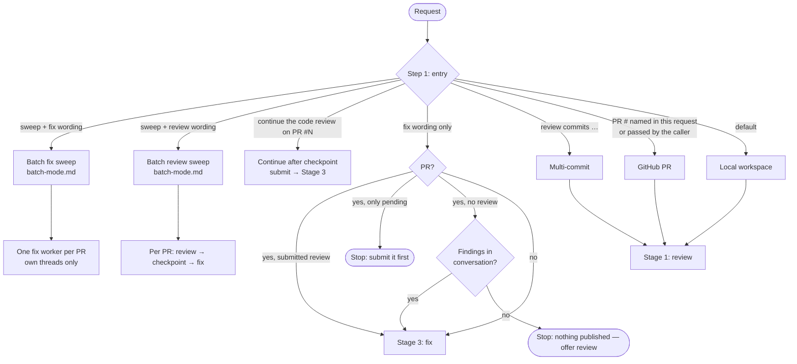
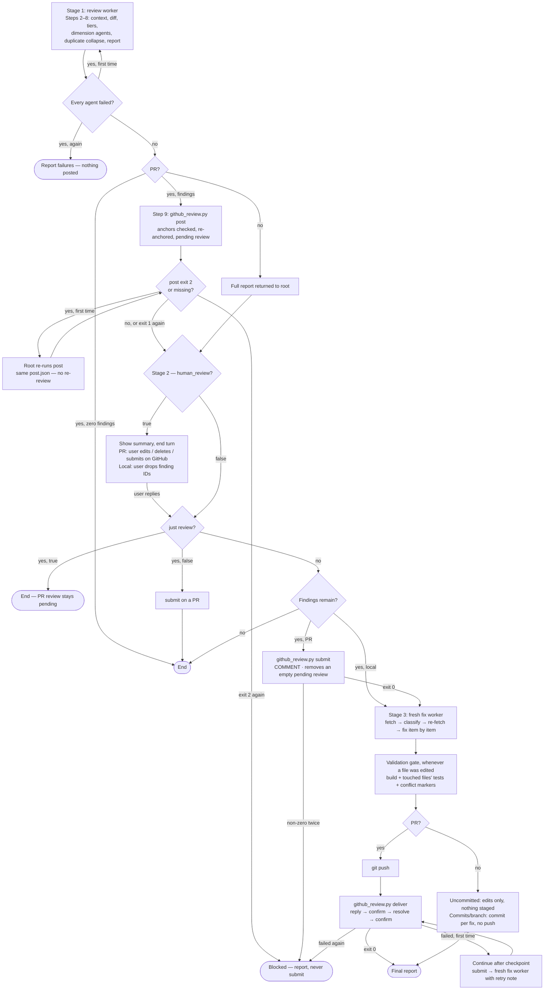
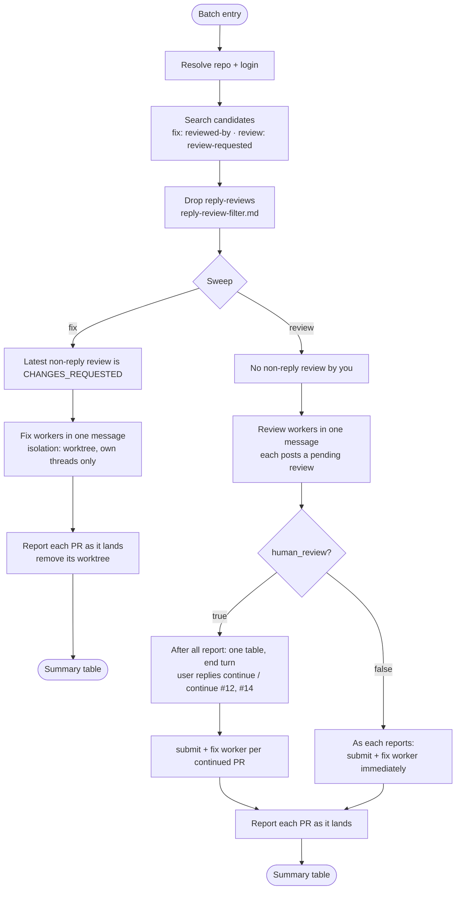

# code-review — Workflow

For human review and maintenance. Never loaded at runtime: `SKILL.md` and `references/` are the source of truth, and this file must be updated alongside them.

## Entry Routing

## The Chain

## Batch Sweeps

## Entries

| Entry | Trigger | Stages | Findings for the fix stage |
|---|---|---|---|
| Batch fix sweep | "fix the PRs I requested changes on" | 3, per PR | Unresolved threads with a comment by you |
| Batch review sweep | "review my pending PRs" | 1 → 2 → 3, per PR | All threads remaining after the checkpoint |
| Continue after checkpoint | "continue the code review on PR #N" (`build-feature` resume) | `submit` → 3 | Every published unresolved thread |
| Fix existing findings | "fix the review comments on PR #N", "fix Q1, H2" | 3 | PR with a submitted review: every published unresolved thread · PR with no review, or no PR: the named or all conversation findings |
| GitHub PR | PR number named in the current request, or passed by the caller — never one only mentioned earlier | 1 → 2 → 3 | Threads remaining after the checkpoint |
| Local workspace | Default | 1 → 2 → 3 | Report findings not dropped at the checkpoint |
| Multi-commit | "review commits …" | 1 → 2 → 3 | Report findings not dropped at the checkpoint |

The PR's author is never checked — every PR follows the same flow.

## Parameters

| Parameter | Default | Values | Controls |
|---|---|---|---|
| `human_review` | `false` | `true` · `false` | Whether Stage 2 pauses for the user. `build-feature` passes its own value, or `false` when `code-review` is in its `human_review_exclude` |
| `scope` | `both` | `both` · `code` · `tests` | Which files the review stage covers |

Wording, not parameters: "just review" ends after Stage 2; "and update the Jira ticket" turns on Jira sync.

## Stage 2 Behavior

| Target | `human_review: true` | `human_review: false` | "Just review" |
|---|---|---|---|
| GitHub PR | Pending review; end turn; user edits on GitHub and replies → `submit` → fix | `submit` → fix | `true`: stays pending, run ends · `false`: `submit`, run ends |
| Any, review failed twice or zero findings | No pause, no `submit`, no fix — report | Same | Same |
| Local / commits | Report shown; end turn; user drops IDs and replies → fix | Fix every finding | Run ends after the report |

## Recovery

Each failure is retried once, before the pause when it happens before the pause, so the user only ever checks findings that are really on GitHub.

| Failure | Retry | Never |
|---|---|---|
| `deliver` failed, or the fix worker failed outright after its own retry | Continue after checkpoint: `submit` (exit `0` either way), then a fresh fix worker told that already-pushed commits are fixes still owed a reply | Reject a thread as "already addressed" because its fix is already on the branch |
| `deliver` refused: this identity holds a pending review | None — ask the user to submit or discard it | Reply while it exists (a reply could land inside it, unseen) |
| `post` exit `2` or non-empty `missing` | Root re-runs `post` from the same `post.json` | Re-run the review; `submit` after a second exit `2` |
| Review failed | Stage 1 again with a fresh review worker | Continue after checkpoint — it never posts, so the findings would be lost |
| `submit` non-zero | `submit` again | Start the fix stage on an unconfirmed submit |

`build-feature` stops on a review or posting failure `code-review` could not recover, and retries the continue-after-checkpoint entry once for a `submit` or delivery failure.

## Workers

| Worker | Dispatched by | Model | Isolation | Dispatches | Returns to root |
|---|---|---|---|---|---|
| Dimension agent | Review worker | `sonnet` | — | Nothing | Findings with `anchor` |
| Fix worker (batch) | Root | `sonnet` | `worktree` always | Nothing | Outcomes, `deliver` JSON counts, commits, gate |
| Fix worker (single) | Root | `sonnet` | `worktree` when not on the PR branch; none when on it, or local | Nothing | Outcomes, `deliver` JSON counts, commits, gate |
| Review worker | Root | `sonnet` | — | Dimension agents | Local: full report · PR: URL, banner, counts, `post` JSON counts, unpostable list |

The root is a live conversation, or `build-feature`'s orchestrator invoking this skill via `Skill`. When a subagent executes this skill outside that structure, it runs the stages inline: `human_review: false` goes straight through; `true` stops after Stage 1 with `awaiting_approval: true`. Running the fix stage inline on a PR, it uses the current checkout when it is on the PR branch, the worktree that has the branch when one does, and otherwise creates its own worktree with `git worktree add` and removes it at the end — never `gh pr checkout` in a checkout it was not given.

## Fix Outcomes on a PR

| Outcome | Decided at | Commit | Reply | Resolve |
|---|---|---|---|---|
| Answer-only | Classification | No (unless the answer implies a change) | The answer | No — the user resolves it |
| Blocked | Fix time (no clear remedy, stale file state) | No | Only a specific question, else skipped with reason | No |
| Fixed | Fix time (finding holds) | Yes, with test impact | What changed, why, test impact | Yes |
| Rejected | Fix time (stale, wrong, or contradicts a stated requirement) | No | The reasoning | Yes |
| Routed to a person | Classification (addressed to @someone) | No | None — skipped with reason | No |
| Unclear | Classification or fix time | No | Only a specific question, else skipped with reason | No |

`deliver` fails the run if any published, unresolved thread is in neither `threads` nor `skipped`.

## GitHub Writes

| Write | Subcommand | Stage | Confirms by |
|---|---|---|---|
| Add review threads to a pending review | `post` | 1 (Step 9) | Re-fetching the review's comments; retries once only comments from a request that failed as a whole |
| Reply to and resolve threads | `deliver` | 3 | Re-fetching threads after replies and after resolves; a thread counts as replied only with a marked reply from this identity |
| Submit the pending review as `COMMENT`, or remove it when it holds nothing | `submit` | 2 | Re-fetching the review's state, or confirming it is gone |

Shared mechanics: argv only (no shell), batches of 10, pacing (post 1 s, reply 5 s, resolve 1 s), 180 s back-off on GitHub's abuse block (at most twice), no blind retry, counts only from re-fetches, exit `0` confirmed / `1` partial / `2` fatal, and `--login` to act as the caller's resolved account. Any non-zero `gh` exit is a failed request unless it is a GraphQL response that still carries `data`; an unexpected response shape is exit `2` with JSON, never a traceback. The only GitHub read the model runs itself is the thread fetch in `github-writes.md`.

## Files Loaded per Run

| File | Loaded when |
|---|---|
| `SKILL.md` | Every run |
| `WORKFLOW.md` | Never at runtime |
| `references/<topic>.code.md`, `<stack>.code.md`, `<stack>-performance.code.md` | By code dimension agents |
| `references/<topic>.tests.md`, `<stack>.tests.md` | By test dimension agents |
| `references/batch-mode.md` | Batch entries |
| `references/code-dimensions.md` | By the review worker, code scope requested |
| `references/fix-stage.md` | Root before Stage 3; fix worker |
| `references/github-writes.md` | Review worker on a PR; fix worker on a PR |
| `references/jira-sync.md` | Fix worker, only when Jira sync is requested |
| `references/reply-review-filter.md` | Batch entries |
| `references/report-format.md` | Review worker |
| `references/sonar.md` | A Sonar project key exists |
| `references/test-dimensions.md` | By the review worker, tests scope requested |
| `scripts/github_review.py` | Every GitHub write |

## Design Notes

- **Review and fix are one run with an optional pause, not two skills.** The pause copies `build-feature`'s checkpoint: post, show a summary, end the turn, continue on the user's reply. With `human_review: false` nothing waits. See STATE.md AD-010.
- **Always two stage workers.** The fix stage starts in a fresh context. The old standalone fix skill's delivery failures happened when replying ran last at peak context (STATE.md FR-AD-007); a fresh worker removes that by construction and makes resuming identical with or without a pause.
- **Only the root dispatches stage workers.** Every nesting failure in the old fix skill's history came from a subagent deciding it was an exception (FR-AD-006). The rule is mechanical: workers never start workers.
- **GitHub is the hand-off.** The fix stage fetches threads fresh, so a comment deleted at the checkpoint is gone, and a human reviewer's comment is picked up the same way as this skill's own.
- **Every GitHub write is scripted.** Posting as prose silently lost 9 of 44 findings on two runs and duplicated 9 comments on another; replying as prose was reported done five times when nothing landed (CPR-AD-003, FR-AD-007). The script reports only what a re-fetch confirms.
- **`deliver` is no longer identical to the old `deliver.py`** (AD-011). The checkpoint invites the user to comment under the same account the review runs as, so "any later comment by this login means already replied" turned a routine edit into a thread resolved with no documentation reply. Replies now carry a hidden marker and only a marked reply counts. `deliver` also refuses to start while this identity holds a pending review, since a reply could land inside it unseen.
- **Recover the step that failed, never a later one.** A failed post re-runs `post` from the same file; the continue-after-checkpoint path is only for `submit` and delivery, because it never posts — using it after a posting failure would submit nothing and fix nothing while reporting success.
- **The verdict is always `COMMENT`.** Approving or requesting changes is a human judgment; `build-feature` already submitted this way.
- **No separate full-codebase performance mode.** Performance is reviewed as a dimension of every review; the separate full-codebase mode added dispatch exceptions to both merge rules for a report nothing consumed.
- **Local uncommitted changes are never committed.** A commit includes whole files, so it would sweep the user's unfinished edits in with the fixes.
